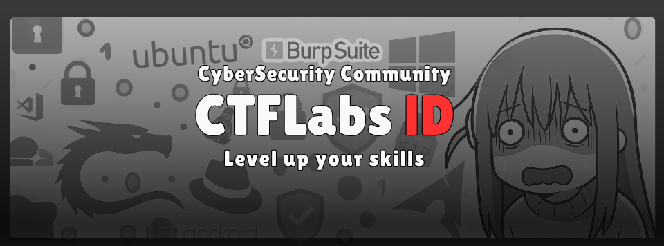

  Welcome To CyberSecuirty Community
  <h1><b>CTFLabs-lD</b></h1>

<b>CTFLabs-ID</b>  adalah sebuah komunitas yang lahir dari semangat belajar bersama dalam dunia keamanan siber. Komunitas ini bukan sekadar tempat berbagi teori, tapi menjadi ruang bagi siapa saja, baik yang baru mulai tertarik maupun yang sudah lama mendalami bidang ini, untuk terus mengasah kemampuan melalui ratusan akses ke Capture The Flag (CTF), simulasi serangan, dan tantangan keamanan digital lainnya.

<b>Jadilah Jagoan CTF Bersama Kami</b>
 
Langkah kecil menuju dunia cybersecurity bisa dimulai dari sini. Kami hadir di berbagai media sosial, waktunya kamu ikut bergabung dan mulai perjalananmu! 
  
  
  

 

<!---

   
  

--->
